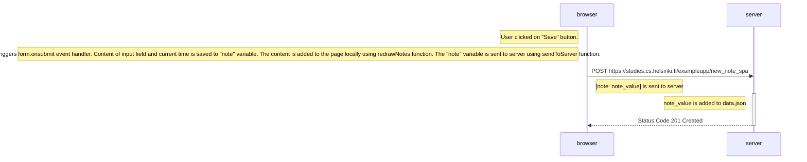

```mermaid
sequenceDiagram
  participant browser
  participant server

  Note left of browser: User clicked on "Save" button.
  Note left of browser: Triggers form.onsubmit event handler. Content of input field and current time is saved to "note" variable. The content is added to the page locally using redrawNotes function. The "note" variable is sent to server using sendToServer function.
  browser->>server: POST https://studies.cs.helsinki.fi/exampleapp/new_note_spa
  Note right of browser: [note: note_value] is sent to server
  activate server
  Note left of server: note_value is added to data.json
  server-->>browser: Status Code 201 Created
  deactivate server
```
