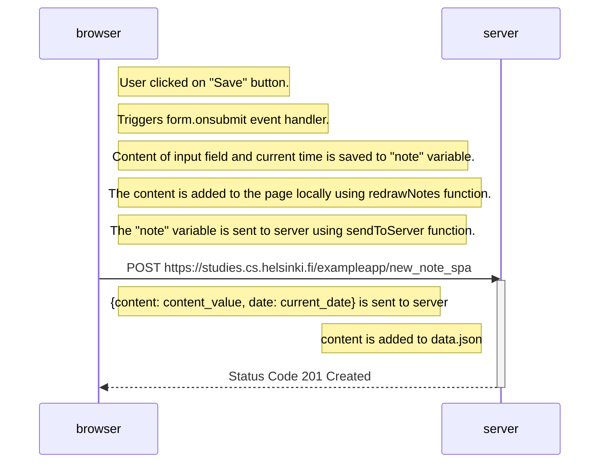

```mermaid
sequenceDiagram
  participant browser
  participant server

  Note right of browser: User clicked on "Save" button.
  Note right of browser: Triggers form.onsubmit event handler.
  Note right of browser: Content of input field and current time is saved to "note" variable.
  Note right of browser: The content is added to the page locally using redrawNotes function.
  Note right of browser: The "note" variable is sent to server using sendToServer function.

  browser->>server: POST https://studies.cs.helsinki.fi/exampleapp/new_note_spa
  activate server
  Note right of browser: {content: content_value, date: current_date} is sent to server
  Note left of server: content is added to data.json
  server-->>browser: Status Code 201 Created
  deactivate server
```
